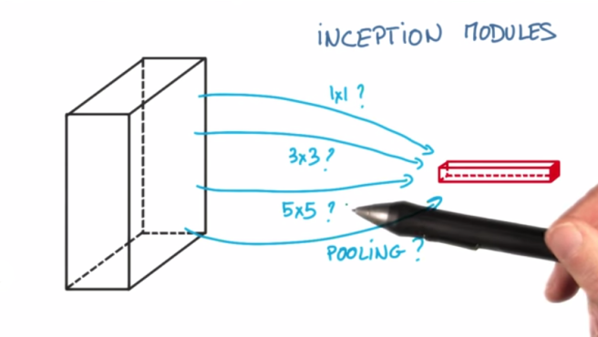

# Traffic Sign Classifier Report

## Data Summary

We explore the data in **Data_Exploration.ipynb**, the data contains 39209 train images with their respective labels and 12630 test images. Labels are contained in signnames.csv, and we can see there are a total of 42 labels. 
    
## PreProcessing

To condition our problem for analysis we need to have as Zero Mean as possible so that the optimizer can have it easily to decrease the variance in its job. Since we are dealing with images we could just substract 128 and divide by 128 each channel of the image, but thankfully opencv already has a tool to do this for us.


`cv2.normalize(image, zeros, alpha=0, beta=1, norm_type=cv2.NORM_MINMAX, dtype=cv2.CV_32F)`

This normalizes our images for our optimizer. 

## Model Architecture
   
   
We try two different methods. One of them is the LeNet architecture which works really fast and really well, allowing us to train our model in a short period of time. This model is contained in LeNet-Car-Traffic.ipynb. 

To reduce overfitting we add Dropout, which at the beginning reduces the Accuracy of the training but allows us to training longer without overfitting the same training data. To improve we can add multiple filter sizes, which can be done in the form of inception. We take a page of the inception module done in the <a href="https://www.cs.unc.edu/~wliu/papers/GoogLeNet.pdf">GoogLeNet architecture</a>.


The reason we take this inception module is because it applies several techniques to improve the Convolutional Neural Network. It uses multiple patch sizes, also uses 1x1 convolutions to increase the depth of the image, as well as pooling techniques.

## Dataset and Training

For the LeNet architecture we include additional data by doing some transforms. These include:

```python

rows, cols, depth = norm_image.shape
center = (cols/2, rows/2)
M_180 = cv2.getRotationMatrix2D(center, 180, 1)
rotated_180 = cv2.warpAffine(norm_image, M_180, (cols,rows))

```

This inserted an image rotated into the dataset, at some point we inserted an image rotated by 90 degrees too. Sadly this only inserted noise as the classifier would sometimes have a very similar image for different images, only decreasing our accuracy. For this reason we remove this transforms following the rule of *Garbage in Garbage Out*.

## Solution Design

Our final solution includes two inception modules. At first we increase the depth of our model in every step using parameters found in [Tommy Mulc's post](https://hackathonprojects.wordpress.com/2016/09/25/inception-modules-explained-and-implemented/). Sadly these parameters crushed our EC2 instance and at some point it couldn't allocate memory for a new layer.



We decrease the depth for the whole model and we reduce the learning rate to allow it to search in a slower manner, and we increase the Epochs and reduce the batch size for the same reason. 

The new solution is considerably slower to train than the previous one as we have increased the number of multiplications, it uses 1x1 convolutions to reduce the feature maps for the next layer. In our LeNet network we experiment using dropout on several layers yet we observe we can just keep one or two dropouts, so for our final solution we just keep dropout at the very end of our computation just before outputting the logits of the neural network.

But after training multiple runs and the final run for over 12 hours I can safely say that the inception module is very robust on the validation set. 

## Acquiring New Images

We observe images again in **Data_Exploration.ipynb**. 


Observing the images we can see that most of them are very similar but with different levels of brightness, contrast, or color in them, which is very useful as it allows our network to train the same image on multiple configurations. 

Out of all of them we can see that maybe we could improve the accurary by having more clear images, but it is something to be experimented with.

I'd rather pick an image that has a small dataset so observing that we see the following labels with the least amount of instances representing them in the dataset:

`(0, 210), (19, 210), (37, 210), (27, 240), (32, 240)`

I would also love to get more instance of Label 41 and 42 sadly they are very hard to come by.

## Performance on New Images


## Model Certainty Visualization


