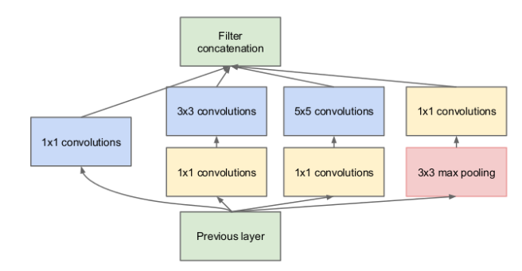

# Traffic Sign Classifier Report

## Data Summary

We explore the data in Data_Exploration.ipynb, the data contains 39209 train images with their respective labels and 12630 test images. Labels are contained in signnames.csv, and we can see there are a total of 42 labels. 
    
## PreProcessing

To condition our problem for analysis we need to have as Zero Mean as possible so that the optimizer can have it easily to decrease the variance in its job. Since we are dealing with images we could just substract 128 and divide by 128 each channel of the image, but thankfully opencv already has a tool to do this for us.

`cv2.normalize(image, zeros, alpha=0, beta=1, norm_type=cv2.NORM_MINMAX, dtype=cv2.CV_32F)`

This normalizes our images for our optimizer. 

## Model Architecture
   
   
We try two different methods. One of them is the LeNet architecture which works really fast and really well, allowing us to train our model in a short period of time. This model is contained in LeNet-Car-Traffic.ipynb. 

To reduce overfitting we add Dropout, which at the beginning reduces the Accuracy of the training but allows us to training longer without overfitting the same training data. To improve we can add multiple filter sizes, which can be done in the form of inception. We take a page of the inception module done in the <a href="https://www.cs.unc.edu/~wliu/papers/GoogLeNet.pdf">GoogLeNet architecture</a>.

